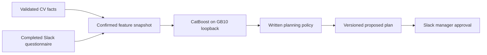

# Readiness prediction and planning on the GB10

Training, preprocessing, CatBoost inference and the application run on the GB10. The classifier is separate from NemoClaw CV extraction; no external AI API is used. Slack and AgentMail remain external communications services.



## Planning contract

Questionnaire confirmation atomically stores the snapshot and marks the case complete. Confirmation automatically drafts the plan; manual proposals also require that snapshot. Policy tailoring, generated lessons and classifier inputs use this frozen record. Missing data stays missing.

The HTTP adapter accepts only literal loopback addresses, refuses redirects and uses a bounded timeout. It identifies the model once per app runtime. Replace the classifier and restart the application together when updating a model.

`readiness_predictions` stores prediction ID, snapshot version/hash, model/preprocessing version, mode, class, all three probabilities, missing-input flags and timestamp. Revisions reuse successful predictions for the same snapshot, artifact and mode. Failures are recorded and retried on a later proposal. The prediction is part of the plan's hashed content; changing it invalidates approval. Manager overrides leave the original prediction intact.

Slack proposals, Evidence and the dashboard show the recommendation, probabilities, synthetic-training status and model/snapshot versions.

## Modes and policy

| `OB_CLASSIFIER_MODE` | Effect |
|---|---|
| `off` (default) | Existing CV/license policy; no classifier call |
| `advisory` | Record/show prediction; existing policy selects track |
| `demo` | Prediction selects proposed policy track; manager approves |

| Class | Track | Training | Mentor days | First route day | Day 10 route limit |
|---|---|---|---|---|---|
| beginner | foundations | Full introductory curriculum | 3, days 4–6 | 7 | 60% |
| okay | intermediate | Two-hour driving refresher, one-hour customer refresher, dispatch app training | 2, days 4–5 | 6 | 80% |
| expert | experienced | Experienced curriculum and Fleetwing app training | 1, day 3 | 4 | 100% |

This is demo policy `FWX-ONB-2026.2`, not a productivity prediction. Safety, hours-of-service, scanner, lifting and mentor modules cannot be removed by a tier or manager override. Scanner experience shortens its module according to policy. Licensed workers retain vehicle inspection. Without a license, tier overrides cannot enable a licensed track, vehicle inspection or solo-route targets. Intermediate is a specific reduced curriculum, not a uniform 50% cut.

Unavailable or invalid inference visibly falls back to existing policy. In demo mode, top probability below 0.60, a class margin below 0.15, or missing delivery/license/rating inputs blocks approval until a manager resolves the review with a note. These are demo review thresholds; probabilities are uncalibrated. Use advisory mode for real workers until independent assessments validate the model.

## Install and verify on GB10

```sh
errand --on gb10 --no-apply --artifact ml/artifacts -- sh scripts/setup-classifier.sh
```

The script runs app checks, installs locked CatBoost dependencies, generates 1,000 rows, trains on GB10 CPU, checks saved models and serving parity, and installs the classifier user service. It then exercises all three tiers through HTTP inference, plans, manager approval and dashboard rendering. Smoke tests use an in-memory database and mock communications; they send no real messages.

Persistent GB10 locations:

- Environment: `~/.local/share/onboarding-buddy/readiness/.venv`.
- Versioned code/model: `~/.local/share/onboarding-buddy/readiness/releases/<model_version>/`.
- Unit: `~/.config/systemd/user/onboarding-buddy-classifier.service`.
- App classifier settings: `~/.config/onboarding-buddy/readiness.env` (no credentials).
- App runtime settings: `~/.config/onboarding-buddy/runtime.env` (no credentials).
- Loopback endpoint: `http://127.0.0.1:4610` (`/health`, `/predict`).

Startup verifies artifact/preprocessing checksums and feature/class order, then loads the model once. The service restarts on failure, bounds input size and omits worker payloads from logs. User services need an active user manager; login persistence is a separate machine setting.

The installer creates the following settings in `~/.config/onboarding-buddy/readiness.env` if it does not exist. It preserves an existing file. `sh scripts/start-gb10.sh` loads the existing Slack profile, preserved runtime settings and classifier settings using Node's native dotenv support:

```sh
OB_CLASSIFIER_MODE=demo
OB_CLASSIFIER_URL=http://127.0.0.1:4610
OB_CLASSIFIER_TIMEOUT_MS=5000
```

Before replacing a running app, capture its effective non-secret settings. This preserves its database, connector modes and recipient restrictions. The capture script explicitly excludes credential variables:

```sh
errand --on gb10 --no-apply -- python3 scripts/preserve-gb10-config.py
node --env-file=.env --env-file=slack/sandbox.env scripts/gb10.ts check
# Gracefully stop only the existing app job after a successful check.
node --env-file=.env --env-file=slack/sandbox.env scripts/gb10.ts start
```

`start` creates a detached Errand app job on GB10. It forwards existing personal Slack/AgentMail credentials without displaying or saving them. Use `errand ps --on gb10` to find the current app handle; do not start a second app against the same database. The classifier service continues independently of app jobs.

The classifier needs no Slack/email/LLM credentials. A newly proposed plan must record a successful prediction with the `/health` model version; previous approved plans stay pinned. The serving manifest currently accepts the synthetic CatBoost artifact explicitly. A validated real model should be introduced as a separate reviewed artifact/schema update.

## Verified deployment, 2026-10-03

- CatBoost trained on GB10 with 1,000 synthetic rows, seed 42. Held-out synthetic accuracy: 72.7%; macro F1: 0.726.
- Artifact version: `ed931ab734221bda02a60222942c8ab4c70f9d454d2543b1907bb0798ccd9fe1`.
- GB10 typecheck, all 50 app tests and all 11 Python tests passed. The eight readiness tests also passed after strengthening snapshot/license regression coverage.
- Actual loopback inference completed beginner/foundations, okay/intermediate and expert/experienced plans through manager approval, mock sending and dashboard rendering. No real worker messages were sent by those smoke tests.
- Classifier user service is active and enabled; GB10 user lingering is already enabled. `/health` matches the verified artifact.
- App job at verification: `gb10/01M41QS50QZG8QMBP1HN72ZXB0`. Its dashboard reports demo mode and live Slack/AgentMail with local NemoClaw. Slack socket connection was verified. Resolve the current handle with `errand ps --on gb10` before future restarts.
- Existing database preserved at `/home/dell/.local/share/onboarding-buddy/onboarding.db`; pre-deployment backup: `backups/pre-readiness-20261003T203633Z.db` beneath that directory.

The integration was rebased onto the newer automatic-drafting and tailored-lesson flow before publication. The previous subprocess classifier was replaced by the versioned loopback service; legacy advisory estimates in stored plans remain readable without changing their approval hashes. All three tiers are supported by the interactive training page.
After reconciliation, GB10 typecheck and all 55 app tests passed. The three classifier tiers also completed mock Slack delivery and interactive training-page decoding.
